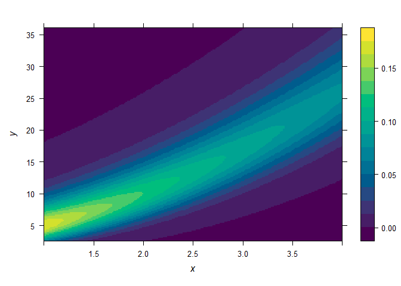
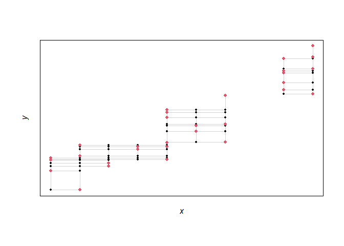
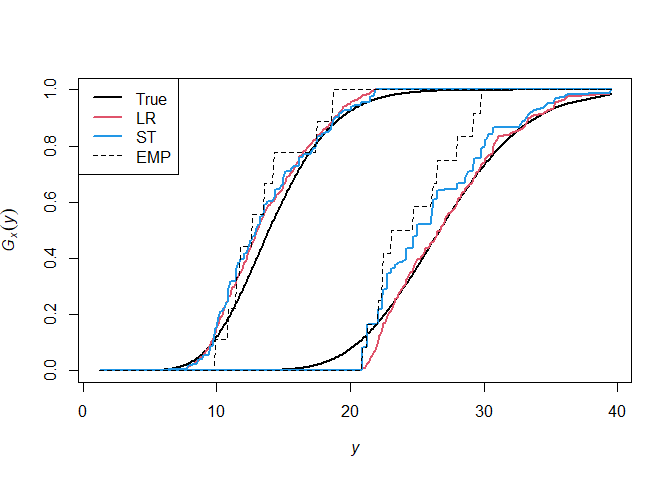
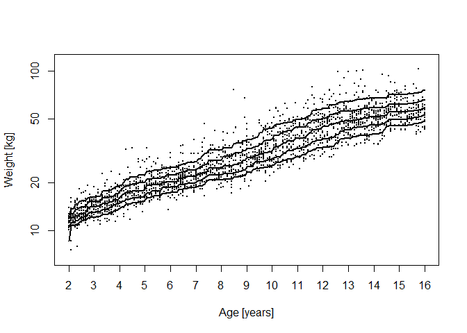

<!-- README.md is generated from README.Rmd. Please edit that file -->

# LRDistReg

<!-- badges: start -->
<!-- badges: end -->

Consider bivariate observations
$(X_1, Y_1), \ldots , (X_n, Y_n) \in \mathbb{R}\times\mathbb{R}$ with
unknown conditional distributions $Q_x$ of $Y$, given that $X = x$. The
goal is to estimate these distributions under the sole assumption that
$Q_x$ is isotonic in $x$ with respect to likelihood ratio order. The
main algorithm of this package estimates the unknown family of
distributions $(Q_x)_x$ via empirical likelihood, see [Moesching and
Duembgen (2022)](https://arxiv.org/abs/2007.11521).

Most functions are implemented both in R and C++ in order to have an
easy to read implementation and a fast one. The package also includes a
growth dataset.

## Installation

You can install the development version of LRDistReg from
[GitHub](https://github.com/) with:

``` r
# install.packages("devtools")
devtools::install_github("AlexandreMoesching/LRDistReg")
```

## PART 1: True model (parametric)

The present demo uses a gamma family of distributions
$(Q_x)_{x\in \mathfrak{X}}$. More precisely
$Q_x := \mathrm{Gamma}\bigl(a(x), b(x)\bigr)$ for all
$x \in \mathfrak{X} := [1,4]$, with some shape
$a: \mathfrak{X} \to (0,\infty)$ and scale
$b: \mathfrak{X} \to (0,\infty)$.

``` r
rm(list = ls())
set.seed(1)
a <- function(x) 2 + (x+1)^2
b <- function(x) 1 - exp(-10*x)
r.cond.dist <- function(x) rgamma(1, shape = a(x), scale = b(x))
p.cond.dist <- function(x, y) pgamma(y, shape = a(x), scale = b(x))
d.cond.dist <- function(x, y) dgamma(y, shape = a(x), scale = b(x))
q.cond.dist <- function(x, alpha) qgamma(alpha, shape = a(x), scale = b(x))
```

Visual output of the true family of distributions. For each $(x,y)$ in a
certain rectangle, the value of $(\mathrm{d}Q_x/\mathrm{d}y)(y)$ is
given by the color scale.



## PART 2: Small data example, first nonparametric fit

Let us start with a small sample: $n = 30$ observations with covariates
in a set $\mathfrak{X}_o := 1 + 3*\{1,2,...,\ell_o\}/\ell_o$, for
$\ell_o = 10$.

``` r
n <- 30; l0 <- 10; x0 <- 1+(1:l0)/l0*3
```

Generate observation pairs $(X_1,Y_1),(X_2,Y_2),...,(X_n,Y_n)$.

``` r
X <- sort(sample(x0, size = n, replace = TRUE))
Y <- rep(0, n)
for (i in 1:n) Y[i] <- r.cond.dist(X[i])
```

We now estimate the family of distribution. We use the function
`dist_reg_R()` with default options.

``` r
library(LRDistReg)
res <- dist_reg_R(X, Y)
plotD(res$par, indices = FALSE)
```



The design of the experiment should be shown. The color of a pair
$(x,y)$ is equal to the number of observations at that location, plus 1.
In consequence, black points contain no observations, red points contain
one observation pair, green points contain two observation pairs, etc.

The family of distributions is estimated at each points of this grid.
The estimated conditional distribution functions are given by
`res$CDF_LR`, an $\ell$-by-$m$ matrix.

## PART 3: A larger data example, comparison between Likelihood-Ratio ordering, usual STochastic ordering and the EMPirical

This time we obtain the fit using a self-specified value of the
precision parameter $\delta_o$. The option `ST = TRUE` will compute
empirical distributions as well as estimates under usual stochastic
order.

``` r
n <- 1e3; l0 <- 1e2; x0 <- 1+(1:l0)/l0*3

X <- sort(sample(x0, size = n, replace = TRUE))
Y <- rep(0, n)
for (i in 1:n) Y[i] <- r.cond.dist(X[i])
Y <- round(Y, 1) # Should create some ties

res <- dist_reg_R(X, Y, delta0 = 1e-2, ST = TRUE)
```

Retrieve all CDF’s and some useful parameters.

``` r
x <- res$par$x; y <- res$par$y; l <- res$par$l;m <- res$par$m
CDF_LR <- res$CDF_LR; CDF_ST <- res$CDF_ST; CDF_EMP <- res$CDF_EMP
CDF_TRUE <- outer(x, y, p.cond.dist)
```

Evaluate estimation quality.

``` r
DIFF_LR <- sum(abs(CDF_LR - CDF_TRUE))/(l*m)
DIFF_ST <- sum(abs(CDF_ST - CDF_TRUE))/(l*m)
DIFF_EMP <- sum(abs(CDF_EMP - CDF_TRUE))/(l*m)
c(DIFF_LR, DIFF_ST, DIFF_EMP)
#> [1] 0.01715160 0.02061282 0.05016851
```

Plot the true CDF as well as its estimators for two values of $x$, one
middle covariate ($x = 2.5$) and one boundary covariate ($x = 4$).



The LR-estimator is in general smoother than the ST-estimator. In this
specific example, the LR-estimator is also closer to the true
distribution than the ST-estimator. This was confirmed already earlier
when looking at average absolute differences.

## PART 4: Growth data and interpolation feature

The package also includes the weight for age dataset which was publicly
released as part of the National Health and Nutrition Examination Survey
conducted in the US between 1963 and 1991 (data available from
[www.cdc.gov](www.cdc.gov)). We take a sample of $n=2000$ girls between
$2$ and $16$ years old, estimate CDF’s (this time using the C++
function) for all ages and month between $2$ and $16$ (using the
interpolation feature `x0`) and produce $\beta$-quantile curves (taut
strings between each pair of lower and upper $\beta$-quantile curves).

``` r
data <- growthdata[(growthdata$sex == 2) &
                     !is.na(growthdata$weight) &
                     (2 * 12 <= growthdata$age.months) & 
                     (growthdata$age.months <= 16 * 12), c("age.months", "weight")]
n_full <- nrow(data)
x0 <- sort(unique(data$age.months)); l0 <- length(x0)

n <- 2e3
ii <- sample(1:n_full, n, replace = FALSE)
X <- data$age.months[ii]; Y <- data$weight[ii]

res <- dist_reg_C(X, Y, rep(1, n), 1e-2, ST = FALSE, x0 = x0)
CDF_LR <- res$CDF_LR; par <- res$par
x <- par$x; y <- par$y

beta.seq <- c(0.10, 0.25, 0.5, 0.75, 0.90); beta.n <- length(beta.seq)

# Compute lower and upper quantile curves, and then a taut string
Q_LR <- Q_LR_L <- Q_LR_U <- matrix(0, nrow = l0, ncol = beta.n)
for (s in seq_along(beta.seq)) {
  for (j in 1:l0) {
    Q_LR_L[j, s] <- y[min(which(CDF_LR[j,] >= beta.seq[s]))]
    Q_LR_U[j, s] <- y[min(which(CDF_LR[j,] >  beta.seq[s]))]
  }
  if (any(Q_LR_L[-c(1, l0), s] != Q_LR_U[-c(1, l0), s])) {
    Q_LR_L[1, s]  <- Q_LR_U[1, s]
    Q_LR_U[l0, s] <- Q_LR_L[l0, s]
    Q_LR[, s] <- taut.string(Q_LR_L[, s], Q_LR_U[, s], x)$Y
  } else {
    Q_LR[, s] <- Q_LR_L[, s]
  }
}

plot(data[ii,], pch = 16, cex = 0.3, xaxt = "n", log = "y",
     ylim = range(data$weight[ii]) * c(0.9, 1.1),
     xlab = "Age [years]", ylab = "Weight [kg]")
axis(1, at = 12 * 2:16, labels = 2:16)
for (s in seq_along(beta.seq)) {
  lines(x0, Q_LR[, s], lwd = 2.5)
}
```


