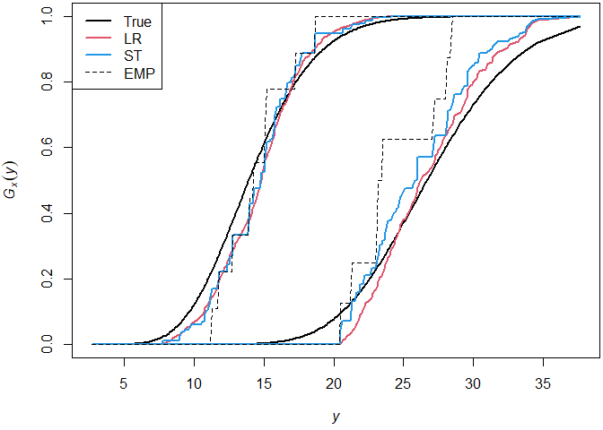

<!-- README.md is generated from README.Rmd. Please edit that file -->

# LRDistReg

<!-- badges: start -->
<!-- badges: end -->

The goal of LRDistReg is to …

## Installation

You can install the development version of LRDistReg from
[GitHub](https://github.com/) with:

``` r
# install.packages("devtools")
devtools::install_github("AlexandreMoesching/LRDistReg")
```

## PART 1: True model (parametric)

The present demo uses a gamma family of distributions
$(Q_x)_{x\in \mathfrak{X}}$. More precisely $$
Q_x := \mathrm{Gamma}\bigl(a(x), b(x)\bigr),\quad \text{for all}\ x \in \mathfrak{X} := [1,4],
$$ with some shape $a: \mathfrak{X} \to (0,\infty)$ and scale
$b: \mathfrak{X} \to (0,\infty)$.

``` r
rm(list = ls())
set.seed(111)
a <- function(x) 2 + (x+1)^2
b <- function(x) 1 - exp(-10*x)
r.cond.dist <- function(x) rgamma(1, shape = a(x), scale = b(x))
p.cond.dist <- function(x, y) pgamma(y, shape = a(x), scale = b(x))
d.cond.dist <- function(x, y) dgamma(y, shape = a(x), scale = b(x))
q.cond.dist <- function(x, alpha) qgamma(alpha, shape = a(x), scale = b(x))
```

Visual output of the true family of distributions. For each $(x,y)$ in a
certain rectangle, the value of $(\mathrm{d}P_x/\mathrm{d}y)(y)$ is
given by the color scale.

``` r
xx <- seq(1, 4, length.out = 2e2)
yy <- seq(q.cond.dist(1, 0.05), q.cond.dist(4, 0.95), length.out = 2e2)
lattice::levelplot(outer(xx, yy, FUN = "d.cond.dist"), 
                   nlevels = 1e2, aspect = "fill",
                   col.regions = hcl.colors(1e2),
                   row.values = xx, column.values = yy,
                   xlab = expression(italic(x)), ylab = expression(italic(y)),
                   xlim = range(xx), ylim = range(yy))
```


``` r

contour(xx, yy, outer(xx, yy, FUN = "d.cond.dist"),
        nlevels = 20,
        xlab = expression(italic(x)), ylab = expression(italic(y)),
        xlim = range(xx), ylim = range(yy))
```


## PART 2: Small data example, first (nonparametric) fit

Let us start with a small sample: $n = 30$ observations with covariates
in a set $\mathfrak{X}_o := 1 + 3*\{1,2,...,\ell_o\}/\ell_o$, for
$\ell_o = 10$.

``` r
n <- 30
l0 <- 10
x0 <- 1+(1:l0)/l0*3
```

Generate observation pairs $(X_1,Y_1),(X_2,Y_2),...,(X_n,Y_n)$.

``` r
X <- sort(sample(x0, size = n, replace = TRUE))
Y <- rep(0, n)
for (i in 1:n) Y[i] <- r.cond.dist(X[i])
```

We now estimate the family of distribution. We use the function
`dist.reg()` with default options, except one plotting option.

``` r
library(LRDistReg)
res <- dist.reg(X, Y, show.design = TRUE)
```


The design of the experiment should be shown. The color of a pair
$(x,y)$ is equal to the number of observations at that location, plus 1.
In consequence, black points contain no observations, red points contain
one observation pair, green points contain two observation pairs, etc.

If `indices = TRUE`, then the values $1,2,...,\ell$ are used for the
plot instead of the unique elements $x_1 < x_2 < ... < x_\ell$ of
$\{X_1,X_2,...,X_n\}$, and the values $1,2,...,m$ are used instead of
the unique elements $y_1 < y_2 < ... < y_m$ of $\{Y_1,Y_2,...,Y_n\}$.
This improves readability of the design plot.

``` r
res <- dist.reg(X, Y, show.design = TRUE, indices = TRUE)
```


The family of distributions is estimated at each points of this grid.
The estimated conditional distribution functions are given by
`res$CDF_LR`, an $\ell$-by-$m$ matrix.

``` r
res$CDF_LR
```

One can also retrieve the jumps only.

``` r
res$q_LR
rowSums(res$q_LR)

res$h_TP2
rowSums(res$h_TP2); res$par$w_j.plus/res$par$n
colSums(res$h_TP2); res$par$w_plus.k/res$par$n
```

To see how the stopping criteria is reached along with the corresponding
values of the negative log-likelihood, the echo option can be activated.

``` r
res <- dist.reg(X, Y)
res$delta0
#> [1] 1e-08
```

## PART 3: Medium data example, specification of precision parameter

Options:

``` r
n <- 1e2
l0 <- 10
x0 <- 1+(1:l0)/l0*3

X <- sort(sample(x0, size = n, replace = TRUE))
Y <- rep(0, n)
for (i in 1:n) Y[i] <- r.cond.dist(X[i])
Y <- round(Y, 1) # Should create some ties
```

This time we obtain the fit using a self-specified value of the
precision parameter epsilon. It is normally automatically specified via
some kind of rule of thumb.

``` r
res <- dist.reg(X, Y, show.design = TRUE, delta0 = 1e-4)
```


``` r
res$tot.time # Less than a tenth of a second on a 7th generation i7 CPU
#> Time difference of 0.13888 secs
```

## PART 4: A larger data example, comparison between Likelihood-Ratio ordering, usual STochastic ordering and the EMPirical

``` r
n <- 1e3
l0 <- 1e2
x0 <- 1+(1:l0)/l0*3

X <- sort(sample(x0, size = n, replace = TRUE))
Y <- rep(0, n)
for (i in 1:n) Y[i] <- r.cond.dist(X[i])
```

We let the program advise us a “reasonable” value for epsilon.

``` r
res <- dist.reg(X, Y, suggest.delta0 = TRUE, ST = TRUE)
res$delta0
#> [1] 10
res$tot.time
#> Time difference of 8.201193 secs
```

Retrieve all CDF’s and some useful parameters.

``` r
x <- res$par$x
y <- res$par$y
l <- res$par$l
m <- res$par$m

CDF_LR <- res$CDF_LR
CDF_ST <- res$CDF_ST
CDF_EMP <- res$CDF_EMP
CDF_TRUE <- outer(x, y, p.cond.dist)
```

Evaluate estimation quality.

``` r
DIFF_LR <- sum(abs(CDF_LR - CDF_TRUE))/(l*m)
DIFF_ST <- sum(abs(CDF_ST - CDF_TRUE))/(l*m)
DIFF_EMP <- sum(abs(CDF_EMP - CDF_TRUE))/(l*m)
c(DIFF_LR, DIFF_ST, DIFF_EMP)
#> [1] 0.01942025 0.02366766 0.05607067
```

Plot the true CDF $F_x$ as well as its estimators for two values of $x$,
one middle covariate ($x = 2.5$) and one boundary covariate ($x = 4$).

``` r
par(mfrow = c(2,1), mar = c(4.1,4.1,0.2,0.2))
xx <- c(2.5, 4)
for (xj in xx) {
  j <- which(xj == x)
  plot(y, CDF_TRUE[j,], type = "l",
       xlab = expression(italic(y)),
       ylab = expression(italic(f[x](y))),
       lwd = 2)
  lines(y, CDF_EMP[j,], lty = 2)
  lines(y, CDF_ST[j,], col = 2, lwd = 2)
  lines(y, CDF_LR[j,], col = 3, lwd = 2)
  legend("topleft", 
         legend = c("True", "EMP", "ST", "LR"),
         col = c(1,1,2,3), lty = c(1,2,1,1), lwd = c(2,1,2,2))
}
```



The LR-estimator is in general smoother than the ST-estimator. In this
specific example, the LR-estimator is also closer to the true
distribution than the ST-estimator. This was confirmed already earlier
when looking at average absolute differences. Try deactivating the
set.seed to see other outputs.

Plot differences between the true CDF and LR/ST-estimators for all
values of $x$. N.b.: it yields 4 pages of plots.

``` r
n.plot <- min(ceiling(sqrt(l)), 5)
par(mfrow = c(n.plot, n.plot), mar = c(2,2,1,1))
unif.ylim <- range(c(CDF_LR - CDF_TRUE, CDF_ST - CDF_TRUE))
for (j in 1:l) {
  plot(y, CDF_ST[j,] - CDF_TRUE[j,], type = "l", col = 2, 
       lwd = 1, ylim = unif.ylim)
  abline(h = 0)
  lines(y, CDF_LR[j,] - CDF_TRUE[j,], col = 3, lwd = 1)
}
```

## PART 5: Interpolation feature

In case the estimators are desired for other values of $x$ than those
provided by the set of covariates, it is still possible to obtain the
estimated CDFs at these other $x$’s using linear interpolation

``` r
n <- 50
l0 <- 50
x0 <- 1+(1:l0)/l0*3

X <- sort(sample(x0, size = n, replace = TRUE))
Y <- rep(0, n)
for (i in 1:n) Y[i] <- r.cond.dist(X[i])

res <- dist.reg(X, Y, suggest.delta0 = TRUE, ST = TRUE)
dim(res$CDF_LR); dim(res$CDF_ST); dim(res$CDF_EMP)
#> [1] 28 50
#> [1] 28 50
#> [1] 28 50
res <- dist.reg(X, Y, suggest.delta0 = TRUE, ST = TRUE, x0 = x0)
dim(res$CDF_LR); dim(res$CDF_ST); dim(res$CDF_EMP)
#> [1] 50 50
#> [1] 50 50
#> [1] 50 50
```
